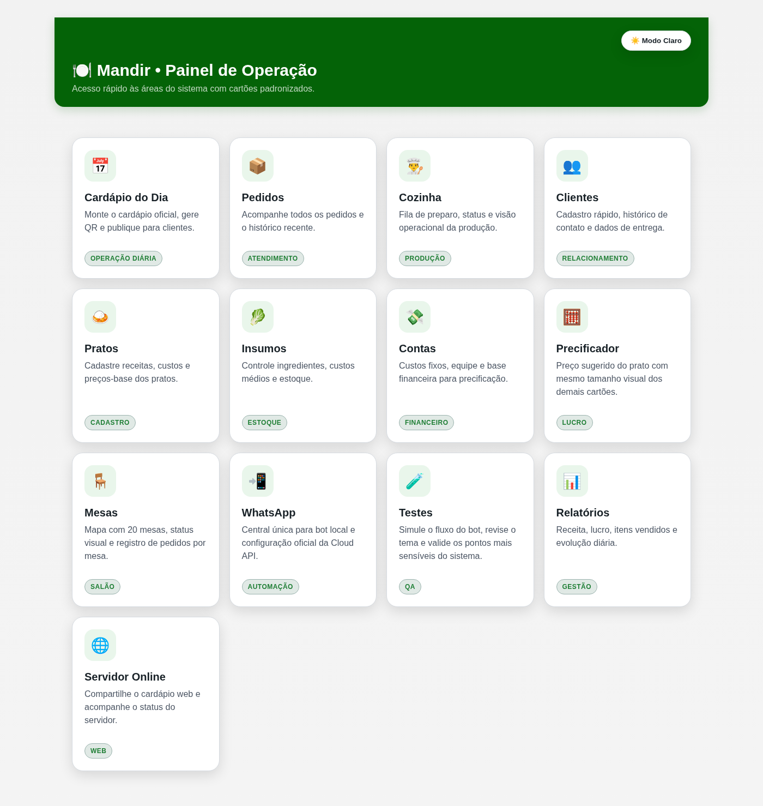
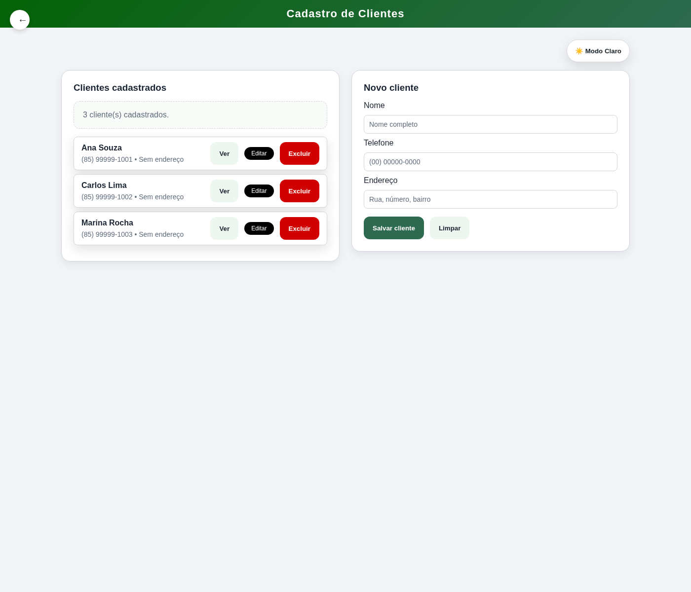
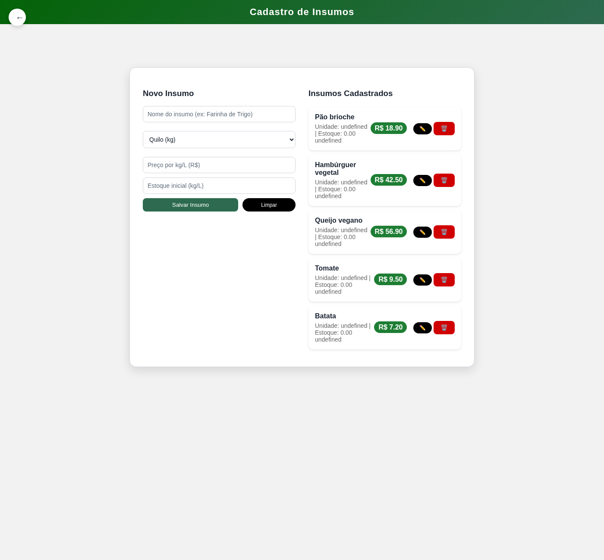
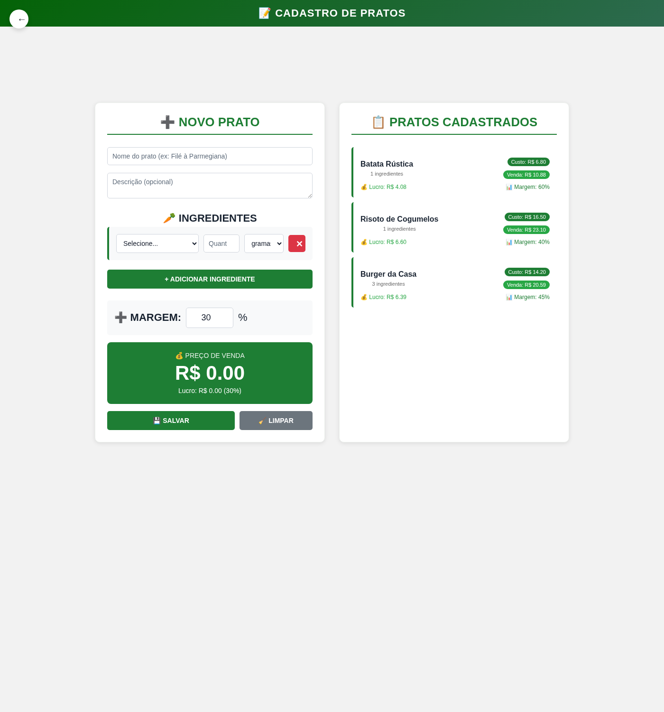
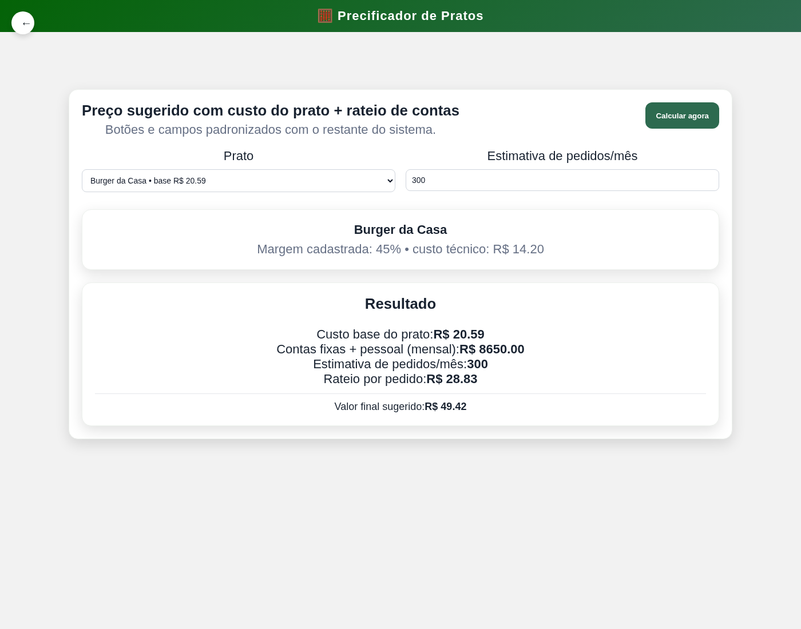
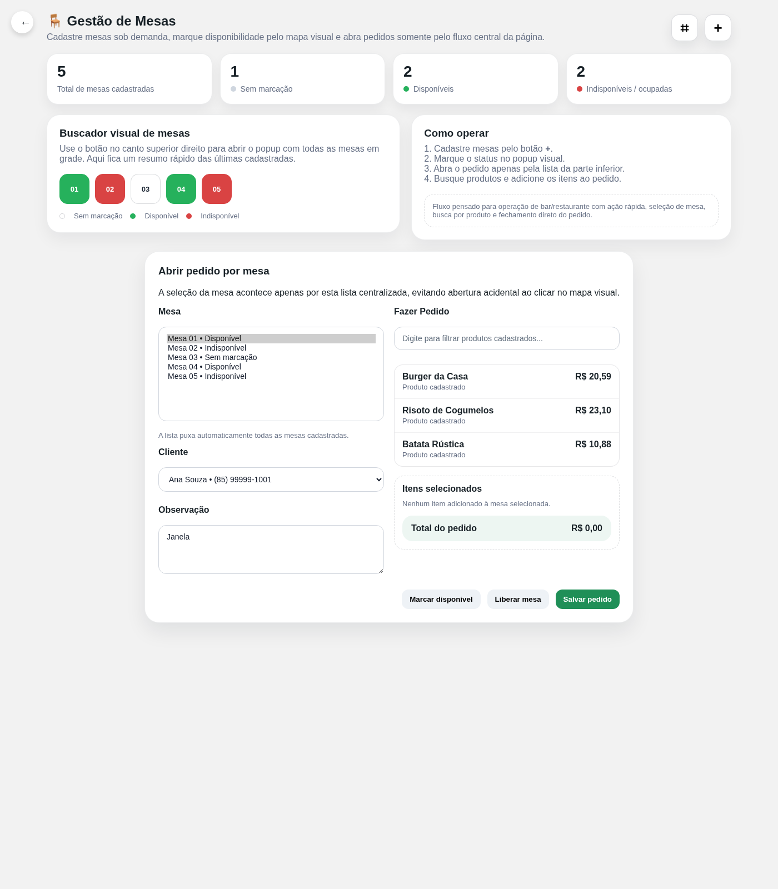
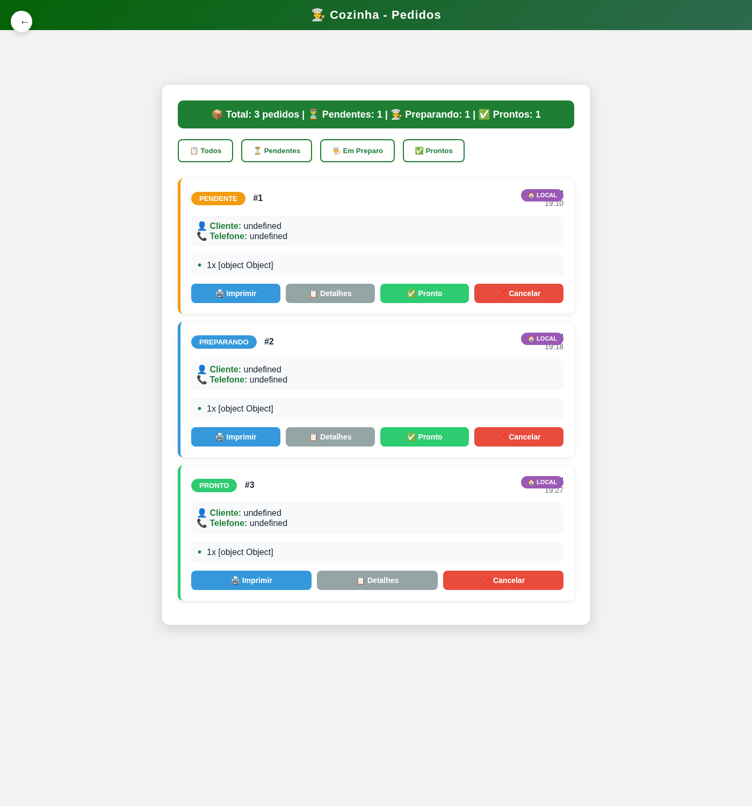

## 📖 Prefácio

Este projeto foi desenvolvido com foco não apenas em funcionalidade, mas principalmente em **acessibilidade e inclusão digital**.

A decisão de utilizar ícones grandes, acompanhados de representações visuais simples (como emojis), foi pensada para tornar a navegação mais intuitiva e acessível para diferentes perfis de usuários, incluindo:

- Jovens adultos com pouco contato com tecnologia
- Pessoas idosas
- Usuários com baixa escolaridade ou dificuldade de leitura

A ideia central é reduzir ao máximo a dependência de textos complexos, permitindo que o sistema seja compreendido de forma mais visual e direta, facilitando o uso no dia a dia de um restaurante.

Além disso, o projeto segue em constante evolução. Em versões futuras, está prevista a implementação de recursos de **audiodescrição e suporte assistivo**, visando atender pessoas com baixa visão ou deficiência visual, tornando a experiência ainda mais inclusiva.

Este sistema não busca apenas resolver um problema operacional, mas também contribuir para uma tecnologia mais acessível, simples e democrática.
💡 Se quiser deixar ainda mais forte (opcional)
• Sistema de Operação para Restaurante

Aplicação desktop construída com Electron para centralizar a rotina operacional de restaurante em um único painel. O sistema reúne cadastro técnico de pratos, controle de insumos, precificação, gestão de mesas, acompanhamento de pedidos e visão de cozinha, reduzindo troca de contexto entre telas separadas.

## Visão geral

O produto foi estruturado para apoiar o fluxo diário do salão e da produção:

- painel inicial com acesso rápido às áreas principais
- cadastro de clientes para atendimento recorrente
- controle de insumos com base de custo técnico
- cadastro de pratos com ingredientes, custo e margem
- precificador com rateio de contas e valor sugerido
- gestão de mesas com mapa visual e pedido por mesa
- acompanhamento operacional de pedidos e cozinha

## Stack

- Electron
- HTML, CSS e JavaScript
- Persistência local em JSON
- Integração preparada para rotinas de WhatsApp e servidor local

## Demonstração visual

### Painel inicial


### Clientes


### Insumos


### Cadastro de pratos


### Precificador


### Gestão de mesas


### Cozinha


## Fluxos cobertos

### Cadastro técnico de pratos
A tela de pratos permite montar a ficha técnica com ingredientes, quantidades e unidade de medida. O custo é calculado a partir dos insumos cadastrados e o preço sugerido é atualizado conforme a margem aplicada.

### Precificação operacional
O precificador reaproveita os pratos cadastrados e combina custo técnico com rateio de contas mensais, entregando um valor de venda sugerido por item.

### Operação de mesas
A tela de mesas permite cadastrar novas mesas sob demanda, marcar disponibilidade no mapa visual e abrir pedidos apenas pela lista central de seleção, reduzindo cliques acidentais.

### Produção e acompanhamento
A área de cozinha consolida os pedidos por status para facilitar preparo, priorização e conferência operacional.

## Estrutura do projeto

```text
assets/
  style.css
  theme.js
bot/
data/
docs/
  screenshots/
pages/
main.js
preload.js
index.html
```

## Como executar

```bash
npm install
npm start
```

## Observações

- O projeto usa persistência local para facilitar demonstração e testes.
